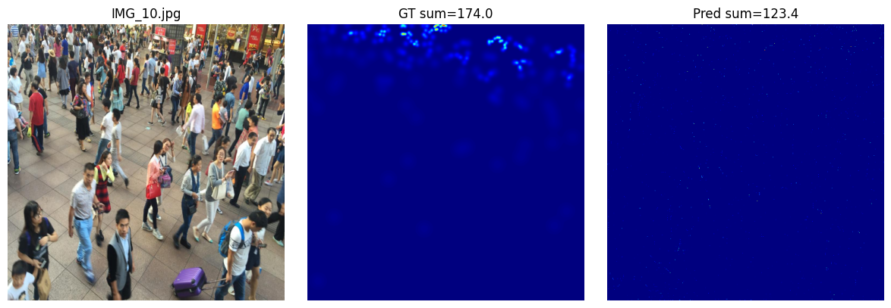
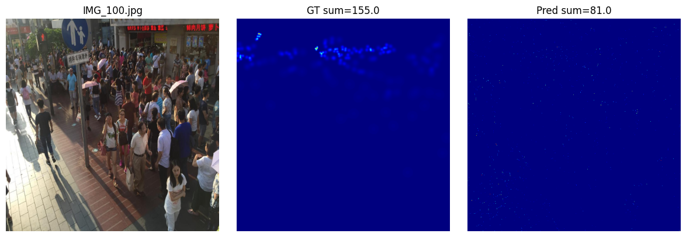
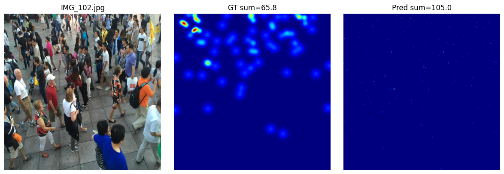
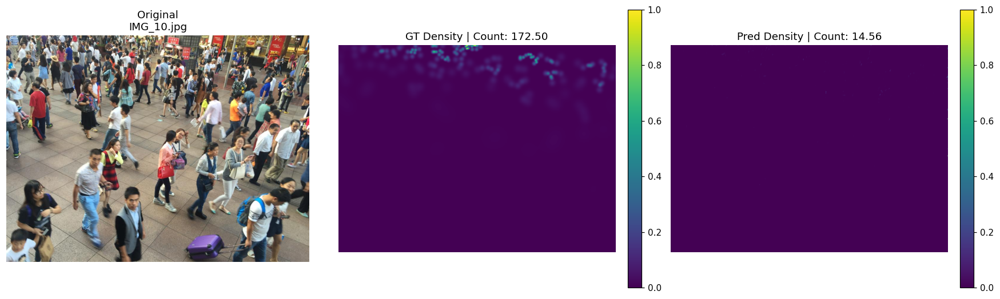
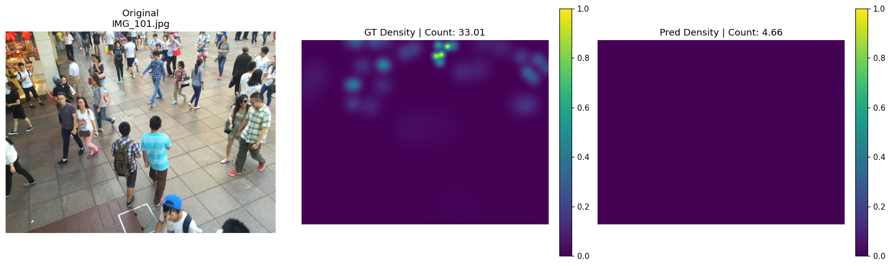

# CrowdCounting-UNet-vs-MCNN
A clean and visual comparison of **U-Net** vs **MCNN** for crowd counting on the **ShanghaiTech Part B** dataset.  
Includes density-map samples, predictions, and a short explanation of the methodology.

---

## 📌 Overview

This repository contains:

- U-Net implementation for density-map based crowd counting  
- MCNN (Multi-Column CNN) implementation for multi-scale feature extraction  
- Training and evaluation setup using ShanghaiTech Part B  
- Full qualitative results (U-Net vs MCNN) using your uploaded images  
- Colab links for reproducing the full experiments  

This project compares how both architectures perform under limited GPU resources (RTX 3060 Ti, 8GB VRAM).

---

## 📊 U-Net vs MCNN — Performance Summary

| Metric | U-Net | MCNN |
|--------|--------|--------|
| **MAE** | **64.28** | 103.98 |
| **RMSE** | **92.97** | 138.39 |

💡 **U-Net clearly outperforms MCNN** in both accuracy and stability due to skip connections that preserve spatial features.

---

## 🔗 Code Notebooks

- **U-Net Notebook:**  
  👉 https://colab.research.google.com/drive/1uQhkrX2g9J1FMEIrL7Rx1mhHCz4G1TPb?usp=sharing  

- **MCNN Notebook:**  
  👉 https://colab.research.google.com/drive/1MSG_VZeYnuKjhfsrATIoM28hr_Vd67zL?usp=sharing  

---

# 📸 U-Net Results (Qualitative)

<p align="center">
  <br><br>
  <br><br>
  <br><br>
  
</p>

---

# 📸 MCNN Results (Qualitative)

<p align="center">
  <br><br>
  <br><br>
  <br><br>
  
</p>

---

## 🛠 Method Summary

### ✔ Dataset  
- **ShanghaiTech Part B**  
- Ground-truth density maps generated using **geometry-adaptive Gaussian kernels**  
- Data augmentations: cropping, flipping, brightness/contrast jitter  

### ✔ U-Net  
- Encoder–decoder  
- Skip connections  
- Produces clear, high-quality density maps  

### ✔ MCNN  
- Three branches with different filter sizes  
- Learns multi-scale features  
- Struggles more in sparse–medium crowd settings  

---

## 🧠 Discussion

- **U-Net performed significantly better**, thanks to preserved spatial features and stable gradient flow.
- **MCNN underestimated** dense regions frequently.
- Both models would improve greatly with:
  - Larger GPUs  
  - Higher-resolution training  
  - More epochs  
  - Larger batch sizes  

Given 8GB VRAM and patch training, the results are acceptable for a constrained environment.

---

## 📚 Citation

If you use this repository, **please cite our paper**:

```bibtex
@misc{hossain2025countformertransformerframeworklearning,
      title={CountFormer: A Transformer Framework for Learning Visual Repetition and Structure in Class-Agnostic Object Counting},
      author={Md Tanvir Hossain and Akif Islam and Mohd Ruhul Ameen},
      year={2025},
      eprint={2510.23785},
      archivePrefix={arXiv},
      primaryClass={cs.CV},
      url={https://arxiv.org/abs/2510.23785},
}
